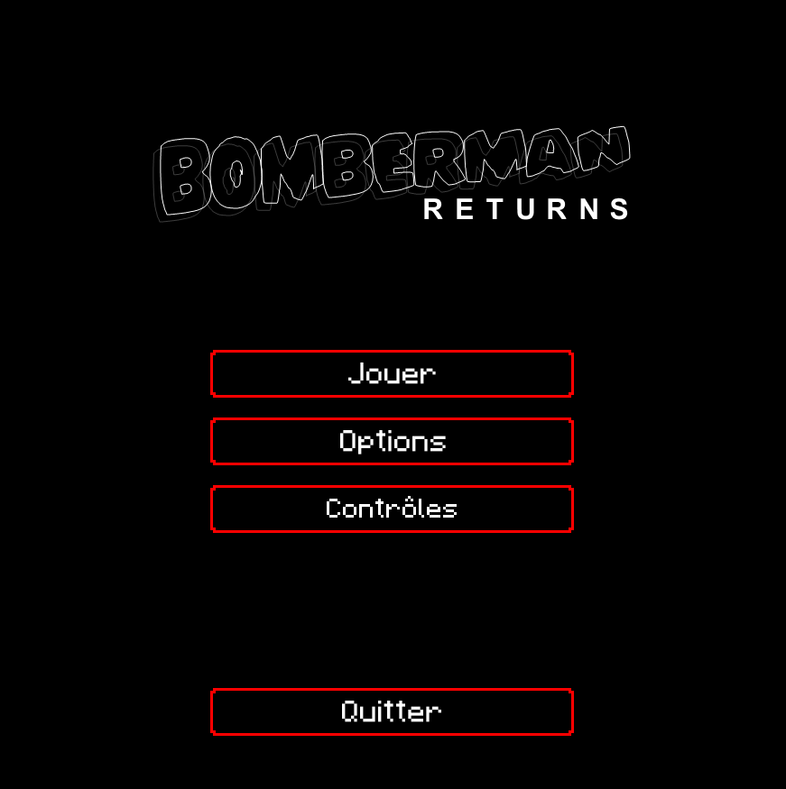
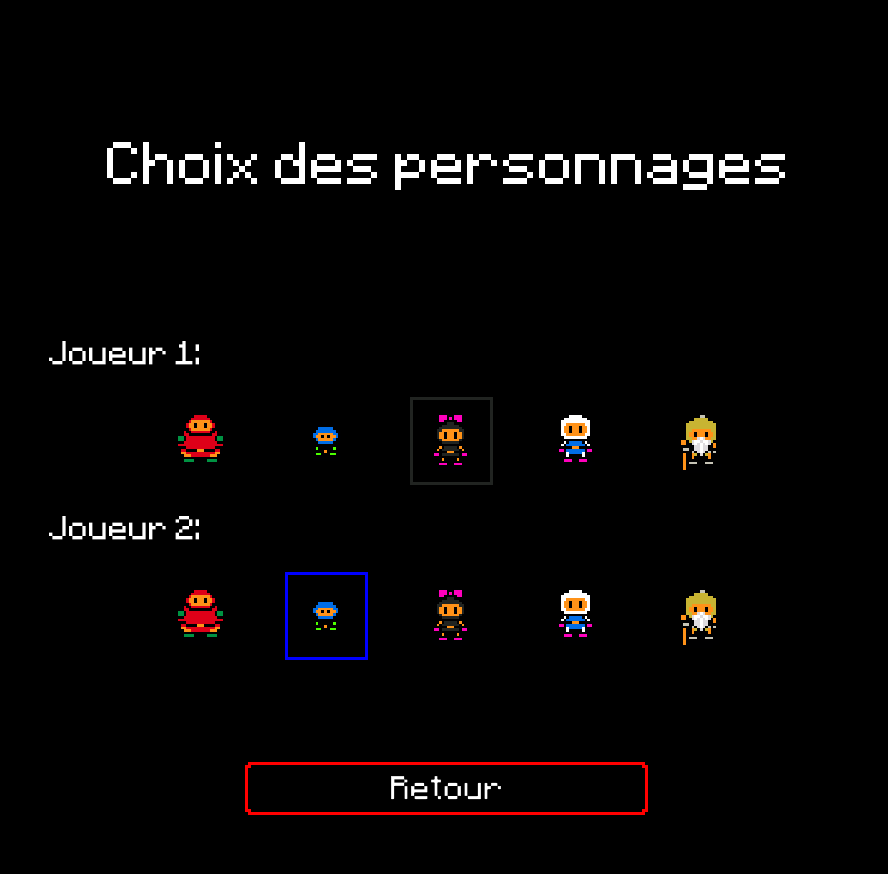
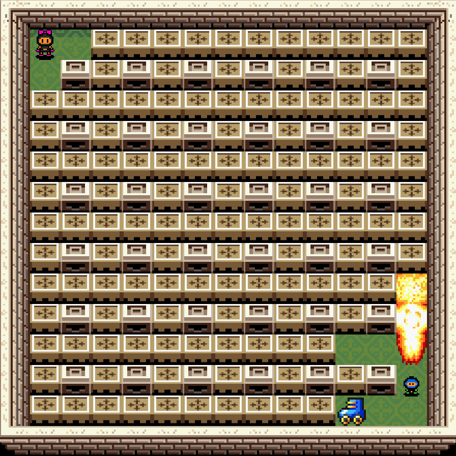

# Bomberman

Création du célèbre jeu Bomberman en C. Les commandes de jeu ainsi que les règles peuvent être affichées une fois le programme lancé.

Un makefile est présent dans le dépôt afin de faciliter la compilation. Le jeu nécessite néanmoins l'installation de la SDL ainsi que de LibTableauNoir.

## Captures d'écran du jeu

